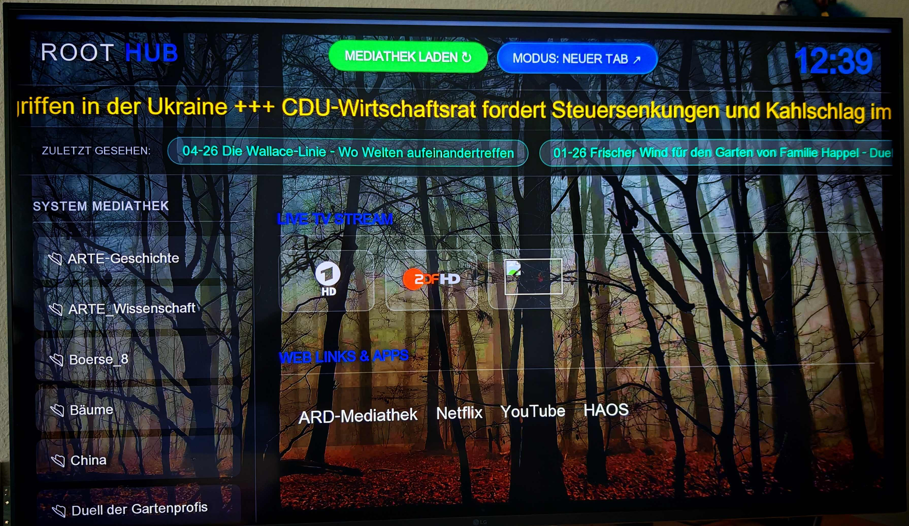

# 📺 Home TV Dashboard (ROOT HUB)

Ein minimalistisches Smart-TV-Dashboard für Enigma2-Receiver und Mediatheken.
Für dem LG-Smart-TV - Webbrowser

(ROOT HUB Dashboard)

---
# 📺 Home TV Dashboard

Ein minimalistisches, webbasiertes Dashboard für das Wohnzimmer. Es vereint Live-TV vom Enigma2-Receiver, automatisierte Mediatheken und Smart-Home-Links.
(mit der Unterstützung von Google-Gemini) (andere TV-Geräte wurden nicht getestet)

## 🚀 Kern-Features
- **Automatisches Mediathek-Update:** Holt sich per RSS die neuesten Inhalte von MediathekViewWeb.
- **Enigma2 Integration:** Stream-Links für Live-TV direkt im Browser.
- **History-Bar:** Zuletzt gesehene Inhalte in einer scrollbaren Schnellwahl.
- **News-Ticker:** Aktuelle Schlagzeilen (Tagesschau).
- **Hybrid-Modus:** Links wahlweise im selben oder in einem neuen Tab öffnen.

## 🛠 Installation
1. Repository klonen: `git clone https://github.com/DEIN-PROFIL/Home-TV-Dashboard.git`
2. Abhängigkeiten installieren: `pip install flask feedparser`
3. Pfad für Playlisten anpassen: Ändere `LANZ_DIR` in der `app.py`.
4. Starten: `python3 app.py`

## 📂 Struktur
- `app.py`: Die gesamte Logik (Backend & Frontend).
- `wald2.jpg`: Dein Hintergrundbild.
- `requirements.txt`: Benötigte Python-Bibliotheken.
